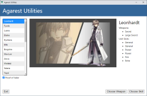
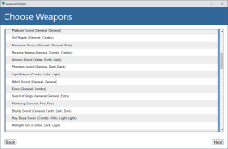
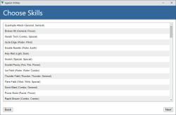
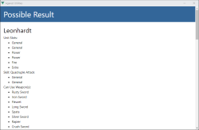

# Agarest: Generations of War Utilities

One day, I've playing game [Agarest](https://en.wikipedia.org/wiki/Record_of_Agarest_War) and think that, how should I wear a weapon to be able to use this combination skill?

I'm a programmer and I think I will write a utility.  I'm thinking about programming tool and it fit with I want to try writing on [nw.js](https://nwjs.io), and, it's answer: AgaUtils.

One thing but sorry, application that build by nw is quite large, very large. :|

# AgaUtils

A simple utility with this step:

- Choose character, and optional, use "Proof of Valor" or not
- click "Choose Weapon", and program will calculate which combination skills you can use
- or click "Choose Skill", and program will calcuate which weapons you must use.

# AgaGen

It's a program to generate data and thank for [Agarest Wiki](https://agarest.fandom.com).

Please note that, program will extract data from Agarest Wiki and it's might be changed.

Currently, it's run on 2023/01/30.

# Running

If you just want to run program and on Windows platform, just download file:

[releases/agautils-1.0.0-win-x86.7z](./releases/agautils-1.0.0-win-x86.7z)

Extract and run agautils.exe.

# Run From Source

If you want to compile and run program from source.  You need [node.js](https://nodejs.org).

First, change to directory:

	cd <Repository>/agautils

Download modules:

	npm i

Then, run:

	npm start

If you want to build packages:

	npm run build

# Run AgaGen

It's no need to run AgaGen since it's extracted and copied data to AgaUtils.  But, if you want to run.

First, change to directory:

	cd <Repository>/agagen

Download modules:

	npm i

Then, run:

	npm start

After run program, the generate data will be save to directory ./out.

You have to copy files to <Repository>/agautils/data.

# Screenshots

Here are some screenshots:

 | 
 | 

# Thank

for Vue template: https://github.com/nwutils.

# Last

I'm not good at English, sorry. T_T

